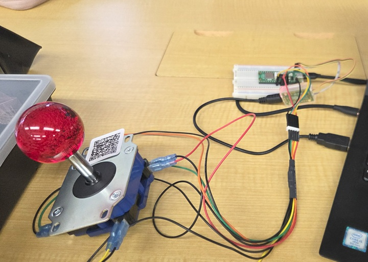

# 説明
raspberry pi picoにアケコン十字キーを繋いでみました  

- 上下左右でマウスカーソル移動
- 長押しで移動量増加
- 左右連打でウィンドウ切り替え(左連打:alt+tab, 右連打: alt+shift+tab送信)

# 開発者向け
## メモ
- https://github.com/raspberrypi/pico-examples/tree/master/usb/device/dev_hid_composite がベース
- 主にGitHub Copilot経由のGPT-5くんに書いてもらいました

## コード整形（clang-format）
- ルートに `.clang-format` を追加しました。
- VS Code では C/C++ ファイル保存時に自動で整形されます（ms-vscode.cpptools）。
- 一括整形したい場合は VS Code のタスク「Format (clang-format)」を実行してください。
	- これは `build` ディレクトリで `ninja format` を呼び、`clang-format` が見つかった場合に `main.c`, `usb_descriptors.[ch]`, `tusb_config.h` を整形します。
	- clang-format が未インストールでも VS Code の保存時整形は `.clang-format` のルールで動作します（拡張機能側が内蔵/同梱のフォーマッタを使用）。

# pin layout
